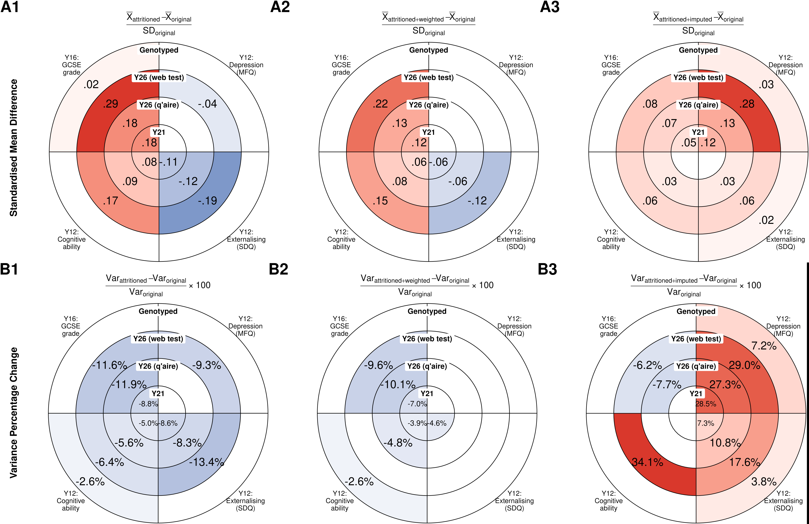
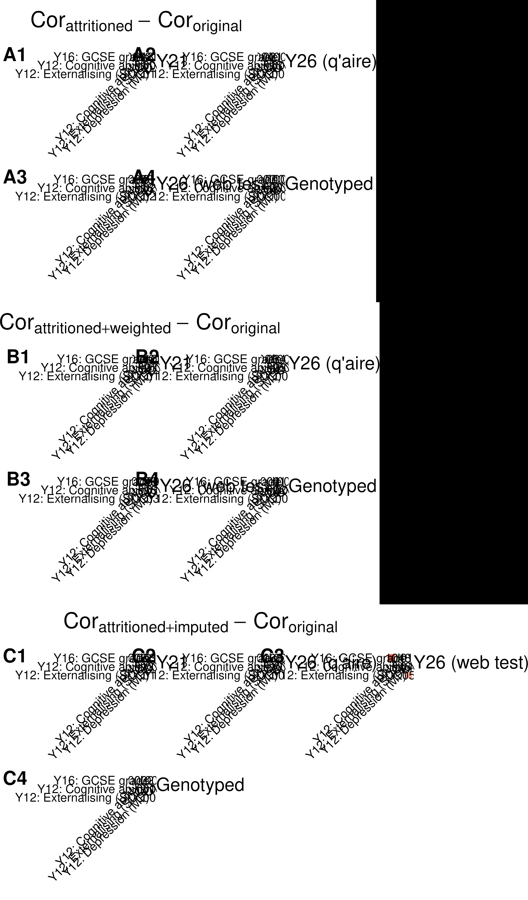
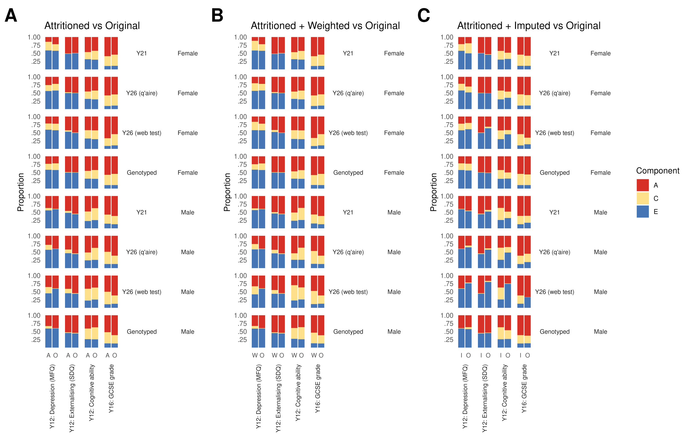

## Description

In this (non-preregistered) analysis, we look at variables collected at years 12 & 16 which have low levels of missingness, and test the effect of selecting only those who took part at year 21 and 26 time points ("attritioning").

This analysis examines the impact of multiple imputation to correct for attrition bias at three different time points.

We compare ( original ) vs ( attritioned + imputed ) results across 200 multiply imputed datasets.

## Load Data

```{r}
#| output: false

source("0_load_data.R")

df = df %>%
  filter(!(randomfamid %in% exclude_fams_rq1x)) %>%
  filter(!(randomfamid %in% exclude_fams_onesib)) %>%
  filter(!(randomfamid %in% exclude_fams_rq6y))

## range of participation outcomes to use for attrition

range_participation_outcomes = 6:8

# Subset vectors to only include participation outcomes in range
rq1y_twin                         = rq1y_twin[range_participation_outcomes]
rq1y_twin1                        = rq1y_twin1[range_participation_outcomes]
rq1y_twin2                        = rq1y_twin2[range_participation_outcomes]
rq1y_twin_labels                  = rq1y_twin_labels[range_participation_outcomes]
rq1y_twin_labels_clean            = rq1y_twin_labels_clean[range_participation_outcomes]
rq1y_twin_labels_clean_extrashort = rq1y_twin_labels_clean_extrashort[range_participation_outcomes]

boot_compare_results = readRDS(file.path("results",        "8_rq6_boot_compare_results.Rds"))
imputed_mice         = readRDS(file = file.path("results", "8_1_imputed_mice.Rds"))
all_imputations      = readRDS(file = file.path("results", "8_1_all_imputations.Rds"))
tasks                = readRDS(file = file.path("results", "8_1_tasks.Rds")) %>%
  mutate(i = 1:nrow(.))

ids_keep = tasks %>%
  filter(imputation <=20) %>% 
  pull(i) %>% max()

all_imputations = all_imputations[1:ids_keep]

gc()

# Number of imputations per timepoint
n_imputations = length(boot_compare_results)/length(range_participation_outcomes)

```


### Focal Variables and timepoints

Attrition time points

```{r}

cbind(
  rq6y,
  rq6y_labels
) %>%
  knitr::kable(caption = "Outcome Variables")

cbind(
  rq1y_twin1,
  rq1y_twin_labels_clean
) %>%
  knitr::kable(caption = "Attrition time points")

```


### Table of all variables used in multiple imputation

```{r}

# Function to map variable prefix to study wave
get_study_wave = function(var_name) {
  prefix = substr(var_name, 1, 1)
  wave_map = c(
    "a" = "1st Contact",
    "b" = "2 Year",
    "c" = "3 Year",
    "d" = "4 Year",
    "e" = "In Home",
    "g" = "7 Year",
    "h" = "8 Year",
    "i" = "9 Year",
    "j" = "10 Year",
    "l" = "12 Year",
    "n" = "14 Year",
    "p" = "16 Year",
    "r" = "18 Year",
    "u" = "21 Year",
    "z" = "26 Year"
  )
  return(wave_map[prefix])
}

rq6_imputation_vars = c(rq6y_all, rq6z_vars)
impute_vars_labels = var_to_label(rq6_imputation_vars) %>%
  sapply(., function(x) ifelse(is.null(x[1]), "", x[1]))

# Create formatted table for imputation variables
v_impute = data.frame(
  Description = impute_vars_labels,
  `Teds Code` = ifelse(rq6_imputation_vars %in% original_colnames, rq6_imputation_vars, paste0(rq6_imputation_vars, "*")),
  `Range or Level` = sapply(rq6_imputation_vars, function(var) {
    if (var %in% colnames(df)) {
      if (class(df[[var]]) == "numeric") {
        paste0(round(min(df[[var]], na.rm = TRUE), 2), " - ", round(max(df[[var]], na.rm = TRUE), 2))
      } else if (is.factor(df[[var]])) {
        factor_levels = levels(df[[var]])
        paste(c(paste0(factor_levels[1], "*"), factor_levels[-1]), collapse = ", ")
      } else {
        paste(unique(df[[var]]), collapse = ", ")
      }
    } else {
      "Variable not found"
    }
  }),
  N = sapply(rq6_imputation_vars, function(var) {
    if (var %in% colnames(df)) {
      sum(!is.na(df[[var]]))
    } else {
      0
    }
  }),
  `Study.Wave` = sapply(rq6_imputation_vars, get_study_wave)
)

gt(v_impute) %>%
  cols_label_with(fn = ~ gsub("\\.", " ", .x)) %>%
  tab_style(
    style = cell_text(size = px(12)),
    locations = cells_body()
  ) %>%
  tab_style(
    style = cell_text(size = px(12)),
    locations = cells_column_labels()
  ) %>%
  cols_hide(N) %>%
  tab_source_note(
    source_note = "Note: Range or Level shows min-max values for numeric variables or factor levels for categorical variables (reference level marked with *). Variable codes with an asterisk (*) have been derived or modified from the original dataset."
  ) %>%
  tab_options(
    table.width = "70%"
  ) %>%
  cols_width(
    Description ~ px(300),
    everything() ~ px(120)
  )

```


## Data Processing

### Transform Raw Results to Dataframe

```{r}
# Create pairwise correlation variable names (if needed for cor_resid later)
test_correlation_matrix = matrix(
  nrow = length(rq6y),
  ncol = length(rq6y)
)

for(i in seq_along(rq6y)){
  for(j in seq_along(rq6y)){
    test_correlation_matrix[i,j] = paste(rq6y[i], rq6y[j], collapse = " ")
  }
}

x = test_correlation_matrix[lower.tri(test_correlation_matrix, diag = FALSE)]

x_var = str_extract(x, "^\\S+")
y_var = str_extract(x, "\\S+$")

rm(test_correlation_matrix,x)

# Split results by timepoint
timepoint_names = rq1y_twin
imputed_comparisons_df = list()

for(tp in seq_along(timepoint_names)){

  timepoint_name = timepoint_names[tp]

  # Get all imputations for this timepoint
  tp_pattern = paste0("^", timepoint_name)
  tp_indices = grep(tp_pattern, names(boot_compare_results))

  # Extract results for each imputation
  tp_results = boot_compare_results[tp_indices]

  # For each metric (md, smd, var), aggregate across imputations
  # Using Rubin's rules for multiple imputation

  metrics = c("md", "smd", "var")
  metric_results = list()

  for(metric_idx in seq_along(metrics)){

    metric = metrics[metric_idx]
    
    metric_data = lapply(tp_results, function(imp) {
      # imp[[metric]] is a list of bootstrap iterations
      # Convert to matrix where rows = bootstrap iterations, cols = variables
      sapply(imp[[metric]], function(boot_iter) boot_iter)
    })

    all_boots = do.call(cbind, metric_data)

    # Calculate summary statistics across all bootstrap samples
    metric_summary = apply(all_boots, 1, function(xx) .mean_qi_pd(xx))
    metric_summary_df = do.call(rbind, metric_summary)

    metric_summary_df = data.frame(metric_summary_df)
    metric_summary_df$dataset = rq1y_twin_labels_clean_extrashort[tp]
    metric_summary_df$stat = metric
    metric_summary_df$variable = rq6y_labels
    rownames(metric_summary_df) = NULL

    metric_results[[metric_idx]] = metric_summary_df
  }

  # Combine metrics for this timepoint
  imputed_comparisons_df[[tp]] = do.call(rbind.data.frame, metric_results)
}

# Combine all timepoints into single dataframe
imputed_comparisons_df0 = do.call(rbind.data.frame, imputed_comparisons_df)
rownames(imputed_comparisons_df0) = NULL

# Save for future use
saveRDS(imputed_comparisons_df0, file.path("results", "8_imputed_comparisons_df.Rds"))

```

### Create Table

```{r}
# Process the dataframe
# Note: Variance values are already percentage change from compare_var function
imputed_comparisons_df = imputed_comparisons_df0 %>%
  mutate(
    variable = rq6y_labels[match(.$variable, rq6y_labels)]
  ) %>%
  group_by(dataset, stat) %>%
  mutate(
    pval_adj = stats::p.adjust(pval, method = "holm")
  )

```

## Means, SMDs, Variances

### GT Results Table

```{r}

imputed_comparisons_df %>%
  filter(stat %in% c("md", "smd", "var")) %>%
  select(-starts_with("."),-pd) %>%
  pivot_wider(
    names_from = "stat",
    values_from = c("y","ymin","ymax","pval","pval_adj"),
    id_cols = c("variable", "dataset")
  ) %>%
  dplyr::rename(Outcome = "variable") %>%
  gt(groupname_col = "dataset") %>%
  tab_options(
    table.width = px(800)
  ) %>%

  # Create column spanners (nested headers)
  tab_spanner(
    label = "Mean Difference",
    columns = c(y_md, ymin_md, ymax_md, pval_md, pval_adj_md)
  ) %>%
  tab_spanner(
    label = "Standardized Mean Difference",
    columns = c(y_smd, ymin_smd, ymax_smd, pval_smd, pval_adj_smd)
  ) %>%
  tab_spanner(
    label = "Variance % Change",
    columns = c(y_var, ymin_var, ymax_var, pval_var, pval_adj_var)
  ) %>%

  # Rename columns under each spanner
  cols_label(
    y_md = "Est", ymin_md = "LB", ymax_md = "UB", pval_md = md("p<sub>unadj</sub>"), pval_adj_md = md("p<sub>adj</sub>"),
    y_smd = "Est", ymin_smd = "LB", ymax_smd = "UB", pval_smd = md("p<sub>unadj</sub>"), pval_adj_smd = md("p<sub>adj</sub>"),
    y_var = "Est", ymin_var = "LB", ymax_var = "UB", pval_var = md("p<sub>unadj</sub>"), pval_adj_var = md("p<sub>adj</sub>")
  ) %>%

  # Format numbers
  fmt(
    columns = !contains("var") & !contains("Outcome"),
    fns = function(x) {gbtoolbox::apa_num(x, n_decimal_places = 3)}
  ) %>%
  fmt(
    columns = c("pval_var", "pval_adj_var"),
    fns = function(x) {gbtoolbox::apa_num(x, n_decimal_places = 3)}
  ) %>%
  fmt_percent(
    columns = c("y_var", "ymin_var","ymax_var"),
    decimals = 2,
    drop_trailing_zeros = FALSE,
    drop_trailing_dec_mark = FALSE
  ) %>%
  # Styling - uniform font size
  tab_style(
    style = cell_text(size = px(10)),
    locations = cells_column_spanners()
  ) %>%
  tab_style(
    style = cell_text(size = px(10)),
    locations = cells_body()
  ) %>%
  tab_style(
    style = cell_text(size = px(10), align = "center"),
    locations = cells_row_groups()
  ) %>%
  tab_style(
    style = cell_text(size = px(10)),
    locations = cells_column_labels()
  ) %>%
  tab_style(
    style = cell_text(size = px(10)),
    locations = cells_footnotes()
  ) %>%

  # Highlight significant results - positive effects (light green)
  tab_style(
    style = cell_fill(color = "#d5e8d4"),
    locations = cells_body(
      columns = c(y_md, ymin_md, ymax_md, pval_md, pval_adj_md),
      rows = pval_adj_md < 0.05 & y_md > 0
    )
  ) %>%
  tab_style(
    style = cell_fill(color = "#d5e8d4"),
    locations = cells_body(
      columns = c(y_smd, ymin_smd, ymax_smd, pval_smd, pval_adj_smd),
      rows = pval_adj_smd < 0.05 & y_smd > 0
    )
  ) %>%
  tab_style(
    style = cell_fill(color = "#d5e8d4"),
    locations = cells_body(
      columns = c(y_var, ymin_var, ymax_var, pval_var, pval_adj_var),
      rows = pval_adj_var < 0.05 & y_var > 0
    )
  ) %>%

  # Highlight significant results - negative effects (light red)
  tab_style(
    style = cell_fill(color = "#f8cecc"),
    locations = cells_body(
      columns = c(y_md, ymin_md, ymax_md, pval_md, pval_adj_md),
      rows = pval_adj_md < 0.05 & y_md < 0
    )
  ) %>%
  tab_style(
    style = cell_fill(color = "#f8cecc"),
    locations = cells_body(
      columns = c(y_smd, ymin_smd, ymax_smd, pval_smd, pval_adj_smd),
      rows = pval_adj_smd < 0.05 & y_smd < 0
    )
  ) %>%
  tab_style(
    style = cell_fill(color = "#f8cecc"),
    locations = cells_body(
      columns = c(y_var, ymin_var, ymax_var, pval_var, pval_adj_var),
      rows = pval_adj_var < 0.05 & y_var < 0
    )
  ) %>%

  # Add footnotes
  tab_footnote(
    footnote = md("<em>Note.</em> Est = Estimate, LB = Lower Bound 95% Confidence Interval, UB = Upper Bound 95% Confidence Interval. Significant (p<sub>Bonferroni-Holm</sub>) effects are highlighted in green (increases) or red (decreases)."),
    placement = "right"
  ) %>%
  tab_footnote(
    footnote = "P values are Bonferroni-Holm adjusted within each attrition timepoint",
    locations = cells_column_labels(columns = contains("pval_adj")),
    placement = "right"
  ) %>%
  tab_footnote(
    footnote = md("Standardized mean difference = (Mean<sub>attrition + imputed</sub> - Mean<sub>original</sub>) / SD<sub>original</sub>"),
    locations = cells_column_spanners(spanners = "Standardized Mean Difference"),
    placement = "right"
  ) %>%
  tab_footnote(
    footnote = md("Percentage change = (Var<sub>attrition + imputed</sub> - Var<sub>original</sub>) / Var<sub>original</sub>"),
    locations = cells_column_spanners(spanners = "Variance % Change"),
    placement = "right"
  ) %>%
  opt_footnote_marks(marks = c("*", "†","‡"))

```

### Create Circular Heatmaps

#### Standardised Mean Differences

```{r}
# Create circular heatmap for SMD
heatmap_data_smd = imputed_comparisons_df %>%
  filter(stat == "smd") %>%
  mutate(
    outcome_labeled = rq1y_twin_labels_clean_extrashort[match(dataset, rq1y_twin_labels_clean_extrashort)],
    outcome_labeled = factor(outcome_labeled, levels = rq1y_twin_labels_clean_extrashort),
    Variables_wrapped = str_wrap(variable, width = 8),
    # Set fill value to NA if not significant, otherwise keep original sign
    fill_value = case_when(
      pval_adj < 0.05 ~ y,
      TRUE ~ NA
    )
  ) %>%
  # Use fixed order from rq6y_labels
  mutate(
    variable = factor(variable, levels = rq6y_labels),
    Variables_wrapped = factor(Variables_wrapped, levels = str_wrap(rq6y_labels, width = 8))
  )

 ggplot(heatmap_data_smd, aes(x = Variables_wrapped, y = outcome_labeled)) +
  geom_tile(aes(fill = fill_value),
            color = "black",
            size = 0.5) +
  geom_text(
    aes(label = ifelse(pval_adj < 0.05,
                       gsub("^(-?)0\\.", "\\1.", sprintf("%.3f", y)), ""),
        size = 4.5
    ),
    color = "black"
  ) +
  scale_size_identity() +
  coord_polar(theta = "x", start = 0, direction = 1, clip = "off") +
  scale_fill_gradient2(
    low = "#2166ac",
    mid = "white",
    high = "#d73027",
    midpoint = 0,
    limits = c(-0.3, 0.3),
    na.value = "white",
    guide = "none"
  ) +
  labs(
    subtitle = expression(frac(bar(X)[attrition + imputed] - bar(X)[original], SD[original])),
    tag = "A3"
  ) +
  theme_minimal() +
  theme(
    axis.text.x = element_text(angle = 0, size = 13, color = "black"),
    axis.text.y = element_blank(),
    axis.title = element_blank(),
    panel.grid = element_blank(),
    panel.background = element_blank(),
    plot.background = element_blank(),
    plot.title = element_blank(),
    plot.subtitle = element_text(hjust = 0.5, size = 17, margin = margin(b = -45)),
    plot.tag = element_text(hjust = 0, vjust = 0, size = 30, face = "bold"),
    plot.tag.position = "topleft"
  ) +
  {
    y_positions = seq_along(levels(heatmap_data_smd$outcome_labeled))
    labels = levels(heatmap_data_smd$outcome_labeled)

    lapply(seq_along(labels), function(i) {
      annotate("text", x = 0.5, y = y_positions[i],
               label = paste0(labels[i], " "), size = 5, hjust = 1, angle = 7, vjust = -.3, fontface = "bold")
    })
  }

save_plot("8_rq6_circular_heatmap_smd", width = 8, height = 8, trim = TRUE)

```

[📊 View Full Resolution SMD Heatmap (PNG)](plots/pngs/8_rq6_circular_heatmap_smd.png)

#### Variance Differences

```{r}
# Create circular heatmap for variance differences
heatmap_data_var = imputed_comparisons_df %>%
  filter(stat == "var") %>%
  mutate(
    outcome_labeled = rq1y_twin_labels_clean_extrashort[match(dataset, rq1y_twin_labels_clean_extrashort)],
    outcome_labeled = factor(outcome_labeled, levels = rq1y_twin_labels_clean_extrashort),
    Variables_wrapped = str_wrap(variable, width = 8),
    # Set fill value to NA if not significant, otherwise keep original sign
    fill_value = case_when(
      pval_adj < 0.05 ~ y,
      TRUE ~ NA
    )
  ) %>%
  # Use fixed order from rq6y_labels
  mutate(
    variable = factor(variable, levels = rq6y_labels),
    Variables_wrapped = factor(Variables_wrapped, levels = str_wrap(rq6y_labels, width = 8))
  )

ggplot(heatmap_data_var, aes(x = Variables_wrapped, y = outcome_labeled)) +
  geom_tile(aes(fill = fill_value),
            color = "black",
            size = 0.5) +
  geom_text(
    aes(label = ifelse(pval_adj < 0.05,
                       paste0(sprintf("%.1f", y * 100), "%"), ""),
        size = 4.5
    ),
    color = "black"
  ) +
  scale_size_identity() +
  coord_polar(theta = "x", start = 0, direction = 1, clip = "off") +
  scale_fill_gradient2(
    low = "#2166ac",
    mid = "white",
    high = "#d73027",
    midpoint = 0,
    limits = c(-.126, .126),
    na.value = "white",
    guide = "none"
  ) +
  labs(
    subtitle = expression(frac(Var[attrition + imputed] - Var[original], Var[original]) ~ "\u00D7" ~ 100),
    tag = "B3"
  ) +
  theme_minimal() +
  theme(
    axis.text.x = element_text(angle = 0, size = 13, color = "black"),
    axis.text.y = element_blank(),
    axis.title = element_blank(),
    panel.grid = element_blank(),
    panel.background = element_blank(),
    plot.background = element_blank(),
    plot.title = element_blank(),
    plot.subtitle = element_text(hjust = 0.5, size = 17, margin = margin(b = -45)),
    plot.tag = element_text(hjust = 0, vjust = 0, size = 30, face = "bold"),
    plot.tag.position = "topleft"
  ) +
  {
    y_positions = seq_along(levels(heatmap_data_var$outcome_labeled))
    labels = levels(heatmap_data_var$outcome_labeled)

    lapply(seq_along(labels), function(i) {
      annotate("text", x = 0.5, y = y_positions[i],
               label = paste0(labels[i], " "), size = 5, hjust = 1, angle = 7, vjust = -.3, fontface = "bold")
    })
  }

save_plot("8_rq6_circular_heatmap_var", width = 8, height = 8, trim = TRUE)

```

[📊 View Full Resolution Variance Heatmap (PNG)](plots/pngs/8_rq6_circular_heatmap_var.png)

### Combine all pngs into one plot

```{r}
library(magick)
gc()
Sys.setenv(MAGICK_MEMORY_LIMIT = "8GiB")
Sys.setenv(MAGICK_MAP_LIMIT = "8GiB")
Sys.setenv(MAGICK_DISK_LIMIT = "16GiB")


# Read all circular plot images
img1 = image_read("plots/pngs/6_rq6_circular_heatmap_smd.png") %>% image_scale("33%")
img2 = image_read("plots/pngs/7_rq7_circular_heatmap_smd.png") %>% image_scale("33%")
img3 = image_read("plots/pngs/8_rq6_circular_heatmap_smd.png") %>% image_scale("33%")
img4 = image_read("plots/pngs/6_rq6_circular_heatmap_var.png") %>% image_scale("33%")
img5 = image_read("plots/pngs/7_rq7_circular_heatmap_var.png") %>% image_scale("33%")
img6 = image_read("plots/pngs/8_rq6_circular_heatmap_var.png") %>% image_scale("33%")


# Combine into rows
row1 = image_append(c(img1, img2, img3))  # SMD plots (A1, A2, A3)
row2 = image_append(c(img4, img5, img6))  # Variance plots (B1, B2, B3)

# Stack rows vertically
combined = image_append(c(row1, row2), stack = TRUE)

# Get dimensions for label positioning
info = image_info(combined)
row_height = info$height / 2

# Add row labels (adjust x and y coordinates as needed)
combined = combined %>%
  image_annotate(
    text = "Standardised Mean Difference",
    size = 50,
    degrees = -90,
    location = paste0("+50+", as.integer(row_height / 2)+450),
    color = "black",
    weight = 700
  ) %>%
  image_annotate(
    text = "Variance Percentage Change",
    size = 50,
    degrees = -90,
    location = paste0("+50+", as.integer(row_height * 1.5)+450),
    color = "black",
    weight = 700
  )

# Save combined image
image_write(combined, "plots/pngs/8_rq6_circular_plots_combined.png")



```

[📊 View plot](plots/pngs/8_rq6_circular_plots_combined.png)

## Correlations

### Plot

```{r}

correlation_comparisons = list()

for(tp in seq_along(timepoint_names)){

  timepoint_name = timepoint_names[tp]

  # Get all imputations for this timepoint
  tp_pattern = paste0("^", timepoint_name)
  tp_indices = grep(tp_pattern, names(boot_compare_results))

  # Extract results for each imputation
  tp_results = boot_compare_results[tp_indices]

  # Extract correlation results across all imputations
  cor_data = lapply(tp_results, function(imp) {
    # imp$cor_resid is a list of bootstrap iterations
    sapply(imp$cor_resid, function(boot_iter) boot_iter)
  })

  # Combine all bootstrap samples across imputations
  all_cors = do.call(cbind, cor_data)

  # Calculate summary statistics
  cor_summary = apply(all_cors, 1, function(xx) .mean_qi_pd(xx))
  cor_summary = do.call(rbind.data.frame, cor_summary)
  cor_summary$x_var = x_var
  cor_summary$y_var = y_var
  cor_summary = cor_summary[cor_summary$x_var != cor_summary$y_var,]  # Remove diagonal
  cor_summary$pval_adj = stats::p.adjust(cor_summary$pval, method = "holm")

  correlation_comparisons[[tp]] = cor_summary
}

library(patchwork)

plots = lapply(1:length(correlation_comparisons), function(i) {
  plot_lower_triangular_matrix2(
    data = correlation_comparisons[[i]],
    variables = rq6y,
    labels = rq6y_labels,
    x_var_col = "x_var",
    y_var_col = "y_var",
    value_col = "y",
    p_col = "pval_adj",
    p_threshold = 0.05,
    show_values = TRUE,
    text_size = 3,
    title = rq1y_twin_labels_clean_extrashort[i],
    caption = NULL,
    method = "none"
  ) +
  labs(tag = paste0("C", i)) +
  theme(
    plot.title        = element_text(hjust=0),
    axis.text         = element_text(color = "black"),
    plot.background   = element_blank(),
    panel.background  = element_blank(),
    legend.background = element_blank(),
    plot.tag          = element_text(size = 14, face = "bold"),
    plot.tag.position = c(0, 1)
  )
})

patchwork::wrap_plots(
  plots,
  ncol = 3) +
  plot_annotation(
    title = expression(Cor[attritioned + imputed] ~ - ~ ~ Cor[original]),
    theme = theme(
      plot.title    = element_text(hjust = 0.5, size = 16, face = "bold"),
      plot.subtitle = element_text(hjust = 0.5, size = 13)
      )
  )

save_plot(
  "8_rq6_correlations", width = 11, height = 3, trim = TRUE, trim_margin = 0)

```

[📊 View Full Resolution Correlation Plots (PDF)](plots/pdfs/8_rq6_correlations.pdf)

### GT Results table

```{r}

cor_table = bind_rows(correlation_comparisons, .id = "timepoint") %>%
  mutate(
    dataset = rq1y_twin_labels_clean_extrashort[as.numeric(timepoint)],
    x_var_label = rq6y_labels[match(x_var, rq6y)],
    y_var_label = rq6y_labels[match(y_var, rq6y)],
    pair = paste(x_var_label, "×", y_var_label)
  ) %>%
  select(dataset, pair, y, ymin, ymax, pval, pval_adj) %>%
  gt(groupname_col = "dataset") %>%
  tab_options(
    table.width = px(800)
  ) %>%

  # Rename columns
  cols_label(
    pair = "Variable Pair",
    y = "Est",
    ymin = "LB",
    ymax = "UB",
    pval = md("p<sub>unadj</sub>"),
    pval_adj = md("p<sub>adj</sub>")
  ) %>%

  # Create column spanner
  tab_spanner(
    label = "Correlation Difference",
    columns = c(y, ymin, ymax, pval, pval_adj)
  ) %>%

  # Format numbers
  fmt(
    columns = c(y, ymin, ymax),
    fns = function(x) {gbtoolbox::apa_num(x, n_decimal_places = 3)}
  ) %>%
  fmt(
    columns = c(pval, pval_adj),
    fns = function(x) {gbtoolbox::apa_num(x, n_decimal_places = 3)}
  ) %>%

  # Styling - uniform font size
  tab_style(
    style = cell_text(size = px(10)),
    locations = cells_column_spanners()
  ) %>%
  tab_style(
    style = cell_text(size = px(10)),
    locations = cells_body()
  ) %>%
  tab_style(
    style = cell_text(size = px(10), align = "center"),
    locations = cells_row_groups()
  ) %>%
  tab_style(
    style = cell_text(size = px(10)),
    locations = cells_column_labels()
  ) %>%
  tab_style(
    style = cell_text(size = px(10)),
    locations = cells_footnotes()
  ) %>%

  # Highlight significant results - positive effects (light green)
  tab_style(
    style = cell_fill(color = "#d5e8d4"),
    locations = cells_body(
      columns = c(y, ymin, ymax, pval, pval_adj),
      rows = pval_adj < 0.05 & y > 0
    )
  ) %>%

  # Highlight significant results - negative effects (light red)
  tab_style(
    style = cell_fill(color = "#f8cecc"),
    locations = cells_body(
      columns = c(y, ymin, ymax, pval, pval_adj),
      rows = pval_adj < 0.05 & y < 0
    )
  ) %>%

  # Add footnotes
  tab_footnote(
    footnote = md("<em>Note.</em> Est = Estimate, LB = Lower Bound 95% Confidence Interval, UB = Upper Bound 95% Confidence Interval. Significant (p<sub>Bonferroni-Holm</sub>) effects are highlighted in green (increases) or red (decreases)."),
    placement = "right"
  ) %>%
  tab_footnote(
    footnote = "P values are Bonferroni-Holm adjusted within each attrition timepoint",
    locations = cells_column_labels(columns = pval_adj),
    placement = "right"
  ) %>%
  tab_footnote(
    footnote = md("Correlation difference = Cor<sub>attritioned + imputed</sub> - Cor<sub>original</sub>"),
    locations = cells_column_spanners(spanners = "Correlation Difference"),
    placement = "right"
  ) %>%
  opt_footnote_marks(marks = c("*", "†", "‡"))

cor_table

```

### Combine all correlation plots into one PNG

```{r}
library(magick)
gc()
Sys.setenv(MAGICK_MEMORY_LIMIT = "8GiB")
Sys.setenv(MAGICK_MAP_LIMIT = "8GiB")
Sys.setenv(MAGICK_DISK_LIMIT = "16GiB")

# Read all correlation plot images
img1 = image_read("plots/pngs/6_rq6_correlations.png")
img2 = image_read("plots/pngs/7_rq7_correlations.png")
img3 = image_read("plots/pngs/8_rq6_correlations.png")

# Add vertical spacing (white border) between images
img1 = image_border(img1, "white", "0x20")  # Add 20px white space at bottom
img2 = image_border(img2, "white", "0x20")  # Add 20px white space at bottom

# Stack all plots vertically
combined = image_append(c(img1, img2, img3), stack = TRUE)

# Save combined image
image_write(combined, "plots/pngs/8_rq6_correlations_combined.png")


```

## ACE Comparison

```{r}

# Extract ACE estimates and differences from all datasets
ace_estimates_list = list()
ace_differences_list = list()

for(tp in seq_along(timepoint_names)){

  timepoint_name = timepoint_names[tp]

  # Get all imputations for this timepoint
  tp_pattern = paste0("^", timepoint_name)
  tp_indices = grep(tp_pattern, names(boot_compare_results))

  # Extract results for each imputation
  tp_results = boot_compare_results[tp_indices]

  # Process ACE results across all imputations
  ace_results = lapply(tp_results, function(imp) {
    lapply(imp$ace, function(x) x)
  })
  
  # Flatten and process
  ace_results = unlist(ace_results, recursive = FALSE)
  ace_results = lapply(ace_results, function(x) do.call(rbind, x))
  ace_results = do.call(rbind, ace_results) %>%
    filter(par %in% c("a","c", "e"))

  ace_results_summary = ace_results %>%
    group_by(par, name, sex, group) %>%
    summarise(
      .mean_qi_pd(value),
      .groups = "drop"
    )

  # Separate estimates and differences
  ace_estimates_list[[tp]] = ace_results_summary %>%
    filter(group != "diff")

  ace_differences_list[[tp]] = ace_results_summary %>%
    filter(group == "diff")

  # Add dataset identifier
  ace_estimates_list[[tp]]$dataset = rq1y_twin1[tp]
  ace_differences_list[[tp]]$dataset = rq1y_twin1[tp]
}

# Combine into single dataframes
ace_estimates = do.call(rbind, ace_estimates_list)
ace_differences = do.call(rbind, ace_differences_list)

# Add readable dataset labels
ace_estimates$dataset_label = rq1y_twin_labels_clean[match(ace_estimates$dataset, rq1y_twin1)]
ace_differences$dataset_label = rq1y_twin_labels_clean[match(ace_differences$dataset, rq1y_twin1)]

```

### Table - ACE estimates

```{r}

ace_estimates %>%
  filter(par %in% c("a", "c", "e")) %>%
  select(-starts_with("."), -n, -pd, -pval) %>%
  mutate(
    name_clean = rq6y_labels[match(name, rq6y_prefix)],
    group = case_when(
      group == "df1" ~ "Original",
      group == "df2" ~ "Imputed",
      TRUE ~ group
    )
  ) %>%
  pivot_wider(
    id_cols = c(dataset_label, name_clean, par, sex),
    names_from = group,
    values_from = c(y, ymin, ymax),
    names_sep = "_"
  ) %>%
  select(dataset_label, name_clean, par, sex,
         y_Original, ymin_Original, ymax_Original,
         y_Imputed, ymin_Imputed, ymax_Imputed) %>%
  arrange(sex, dataset_label, name_clean, par) %>%
  mutate(par = toupper(par)) %>%
  gt(groupname_col = "sex") %>%
  fmt_number(decimals = 3) %>%
  tab_row_group(
    label = "Male",
    rows = sex == "male"
  ) %>%
  tab_row_group(
    label = "Female",
    rows = sex == "female"
  ) %>%
  cols_hide(sex) %>%
  cols_label(
    dataset_label = "Dataset",
    name_clean = "Variable",
    par = "",
    y_Original = "Est",
    ymin_Original = "Lower",
    ymax_Original = "Upper",
    y_Imputed = "Est",
    ymin_Imputed = "Lower",
    ymax_Imputed = "Upper"
  ) %>%
  tab_spanner(
    label = "Original",
    columns = c(y_Original, ymin_Original, ymax_Original)
  ) %>%
  tab_spanner(
    label = "Attritioned + Imputed",
    columns = c(y_Imputed, ymin_Imputed, ymax_Imputed)
  ) %>%
  tab_options(
    table.font.size = px(9)
  )

```

### Table - Changes in ACE Estimates

```{r}

ace_differences_tbl = ace_differences  %>%
  group_by(dataset) %>%
  mutate(
    pval_adj = stats::p.adjust(pval, method = "holm")
  ) %>%
  ungroup()

ace_differences_tbl %>%
  select(-starts_with("."), -n, -pd) %>%
  mutate(name_clean = rq6y_labels[match(name, rq6y_prefix)]) %>%
  select(dataset_label, name_clean, par, sex, y, ymin, ymax, pval, pval_adj) %>%
  arrange(sex, dataset_label, name_clean, par) %>%
  mutate(par = toupper(par)) %>%
  gt(groupname_col = "sex") %>%
  fmt_number(decimals = 3) %>%
  tab_row_group(
    label = "Male",
    rows = sex == "male"
  ) %>%
  tab_row_group(
    label = "Female",
    rows = sex == "female"
  ) %>%
  cols_hide(sex) %>%
  cols_label(
    dataset_label = "Dataset",
    name_clean = "Variable",
    par = "",
    y = "Diff",
    ymin = "Lower",
    ymax = "Upper",
    pval = md("p<sub>unadj</sub>"),
    pval_adj = md("p<sub>adj</sub>")
  ) %>%
  tab_spanner(
    label = "95% CI",
    columns = c(ymin, ymax)
  ) %>%
  tab_style(
    style = cell_fill(color = "#d5e8d4"),
    locations = cells_body(
      columns = everything(),
      rows = pval_adj < 0.05 & y > 0
    )
  ) %>%
  tab_style(
    style = cell_fill(color = "#f8cecc"),
    locations = cells_body(
      columns = everything(),
      rows = pval_adj < 0.05 & y < 0
    )
  ) %>%
  tab_footnote(
    footnote = "Difference = (Attrition + Imputed) − Original. Adjusted P values are Bonferroni-Holm corrected within each sex, dataset, and parameter (A, C or E) group",
    locations = cells_column_labels(columns = pval_adj)
  ) %>%
  tab_options(
    table.font.size = px(9)
  )

```

### ACE Estimates Plot

```{r}

ace_estimates %>%
  mutate(
    name_clean = rq6y_labels[match(name, rq6y_prefix)],
    name_clean = factor(name_clean, levels = rq6y_labels),
    group = case_when(
      group == "df1" ~ "O",
      group == "df2" ~ "I",
      TRUE ~ group
    ),
    group = factor(group, levels = c("I", "O")),
    sex = str_to_title(sex),
    par = toupper(par),
    dataset_label = factor(rq1y_twin_labels_clean_extrashort[match(dataset,rq1y_twin1)], levels = rq1y_twin_labels_clean_extrashort)
  ) %>%
  ggplot(aes(x = group, y = y, fill = par)) +
  geom_col(position = "stack", alpha = 1) +
  facet_grid(sex + dataset_label ~ name_clean, switch = "x") +
  theme_minimal() +
  theme(
    axis.text.x = element_text(angle = 0, hjust = .5, size = 8),
    strip.text = element_text(size = 8),
    strip.text.x = element_text(angle = 90, hjust = 1, vjust = .5),
    strip.text.y = element_text(angle = 0),
    strip.placement = "outside",
    panel.grid = element_blank(),
    plot.tag = element_text(hjust = 0, vjust = 0, size = 24, face = "bold"),
    plot.tag.position = "topleft"
  ) +
  labs(
    title = "Attritioned + Imputed vs Original",
    x = NULL,
    y = "Proportion",
    fill = "Component",
    tag = "C"
  ) +
  scale_y_continuous(breaks = c(.25,.50,.75, 1), labels = c(".25",".50",".75","1.00")) +
  scale_fill_manual(values = c("A" = "#d73027", "C" = "#fee08b", "E" = "#4575b4")) +
  coord_cartesian(ylim = c(0, 1))

save_plot("8_rq6_ace_comparison", width = 5, height = 8)

```
[📊 View Full Resolution ACE Comparison Plot (PNG)](plots/pngs/8_rq6_ace_comparison.png)

### Combine all pngs into one plot

```{r}
library(magick)
gc()
Sys.setenv(MAGICK_MEMORY_LIMIT = "8GiB")
Sys.setenv(MAGICK_MAP_LIMIT = "8GiB")
Sys.setenv(MAGICK_DISK_LIMIT = "16GiB")


# Read all circular plot images
img1 = image_read("plots/pngs/6_rq6_ace_comparison.png") %>% image_scale("33%") %>% magick::image_crop("75%x100%+0+0")
img2 = image_read("plots/pngs/7_rq7_ace_comparison.png") %>% image_scale("33%") %>% magick::image_crop("75%x100%+0+0")
img3 = image_read("plots/pngs/8_rq6_ace_comparison.png") %>% image_scale("33%")


# Combine into rows
row1 = image_append(c(img1, img2, img3))  # SMD plots (A1, A2, A3)

# Save combined image
image_write(row1, "plots/pngs/8_rq6_ace_comparison_combined.png")



```

[📊 View Full Resolution ACE Combined Comparison Plot (PNG)](plots/pngs/8_rq6_ace_comparison_combined.png)

## Supplementary Statistics 

### Effect of attritioning on sample sizes

```{r}

imputed_ss = list()

imputed_ss[[1]] = imputed_mice[[1]][[1]] %>%
  select(all_of(rq6y_all)) %>% 
  pivot_longer(cols = everything(), names_to = "variable") %>% 
  mutate(variable = str_remove(variable, "\\d$")) %>%
  group_by(variable) %>% 
  summarise(
    n = length(which(!is.na(value)))
  ) %>%
  mutate(timepoint = rq1y_twin_labels_clean_extrashort[1])

imputed_ss[[2]] = imputed_mice[[2]][[1]] %>%
  select(all_of(rq6y_all)) %>% 
  pivot_longer(cols = everything(), names_to = "variable") %>% 
  mutate(variable = str_remove(variable, "\\d$")) %>%
  group_by(variable) %>% 
  summarise(
    n = length(which(!is.na(value)))
  ) %>%
  mutate(timepoint = rq1y_twin_labels_clean_extrashort[2])


imputed_ss[[3]] = imputed_mice[[3]][[1]] %>%
  select(all_of(rq6y_all)) %>% 
  pivot_longer(cols = everything(), names_to = "variable") %>% 
  mutate(variable = str_remove(variable, "\\d$")) %>%
  group_by(variable) %>% 
  summarise(
    n = length(which(!is.na(value)))
  ) %>%
  mutate(timepoint = rq1y_twin_labels_clean_extrashort[3])

imputed_ss_combined = do.call("rbind.data.frame", imputed_ss) %>%
  relocate(variable, timepoint, n) %>%
  mutate(condition = "Imputed")

# Create response_statistics combining original, attritioned, and imputed
response_statistics = df %>%
  select(randomtwinid, all_of(rq6y), all_of(rq1y_twin1)) %>%
  mutate(all1 = 1) %>%
  pivot_longer(cols = all_of(rq6y), names_to = "variable", values_to = "score") %>%
  # mutate(randomtwinid = paste0(randomtwinid, "-", str_extract(variable,"\\d$"))) %>% 
  mutate(variable = str_remove(variable, "\\d$")) %>%
  pivot_longer(cols = all_of(c("all1", rq1y_twin1)), names_to = "timepoint", values_to = "participation_indicator") %>%
  filter(!is.na(score)) %>%
  filter(participation_indicator == 1) %>%
  group_by(variable, timepoint) %>%
  summarise(
    n = dplyr::n(),
    .groups = "drop"
  ) %>%
  mutate(
    timepoint = rq1y_twin_labels_clean_extrashort[match(timepoint, rq1y_twin1)],
    timepoint = ifelse(is.na(timepoint), "Original", timepoint),
    condition = "Attritioned"
  )


# Combine all three conditions
response_statistics = bind_rows(
  response_statistics,
  imputed_ss_combined
) %>%
  group_by(variable) %>%
  mutate(
    max_n = max(n),
    percent = n / max_n
  ) %>%
  ungroup()

```

#### Plot

```{r}

response_statistics %>%
  mutate(
    variable = rq6y_labels[match(variable, rq6y_prefix)],
    variable = factor(variable, levels = rq6y_labels),
    timepoint = factor(timepoint, levels = c("Original", rq1y_twin_labels_clean_extrashort)),
    original  = timepoint == "Original"
  ) %>% 
  ggplot(aes(x = timepoint, y = n, group = condition,
             color = condition)) +
  geom_line() +
  geom_point(aes(shape = condition, size = original)) +
  facet_wrap(~variable, nrow = 1) +
    labs(
    title = "Sample Sizes Before and After Attritioning (+Imputation)",
    y = "Sample size",
    x = NULL,
    color = "Condition",
    shape = "Condition",
    size = "Condition"
  ) +
   theme(
    axis.text = element_text(color = "black"),
    axis.text.x = element_text(angle = 45, vjust = 1, hjust = 1, size = 7),
    legend.position = "right"
  ) +
  scale_shape_manual(values = c("Original" = 18, "Attritioned" = 16, "Imputed" = 17)) +
  scale_size_manual(values = c("TRUE" = 4, "FALSE" = 2)) +
  scale_color_manual(values = c("Original" = "black", "Attritioned" = "coral", "Imputed" = "steelblue")) +
  guides(size = "none") +


save_plot("8_attrition_imputation_numbers", width = 9, height = 4)

```

[📊 View Full Resolution Sample Size Plot (PNG)](plots/pngs/8_attrition_imputation_numbers.png)

#### Sample Size Table

```{r}

response_statistics %>%
  mutate(
    variable = rq6y_labels[match(variable, rq6y_prefix)],
    variable = factor(variable, levels = rq6y_labels),
    # Create combined condition-timepoint label
    col_label = case_when(
      condition == "Original" ~ "Original",
      condition == "Attritioned" ~ paste0("Attr: ", timepoint),
      condition == "Imputed" ~ paste0("Imp: ", timepoint)
    ),
    n_pct = paste0(format(n, big.mark = ","), " (", sprintf("%.1f%%", percent * 100), ")")
  ) %>%
  select(variable, col_label, n_pct) %>%
  pivot_wider(names_from = col_label, values_from = n_pct) %>%
  arrange(variable) %>%
  gt() %>%
  cols_label(
    variable = "Variable"
  ) %>%
  tab_spanner(
    label = "Sample Size (% of Original)",
    columns = -variable
  ) %>%
  tab_style(
    style = cell_text(size = px(10)),
    locations = list(
      cells_body(),
      cells_stub(),
      cells_row_groups(),
      cells_column_labels(),
      cells_column_spanners(),
      cells_footnotes()
    )
  ) %>%
  tab_footnote(
    footnote = "Original = full sample. Attr = Attritioned (participants removed). Imp = Imputed (missing values filled in via multiple imputation).",
    placement = "right"
  ) 

```

### Fraction of Missing Information 

#### Calculation for **sample means**

Here, we calculate the fraction of missing information (FMI) for each variable mean.

Because imputation is performed separately at each attrition timepoint, the FMI differs across timepoints. FMI is higher when more data is missing at the attrition timepoint (i.e., fewer participants at that wave). 

```{r}

timepoint_labels = rq1y_twin_labels_clean

fmi_original = map_dfr(seq_along(imputed_mice), function(tp) {
  map_dfr(rq6y, function(v) {                                                                                      # starts loop for each 
    # browser()                                                                                                    # For checking this code...

    Q = sapply(imputed_mice[[tp]], function(df) mean(df[[v]], na.rm = TRUE))                                       # For variable v, this is a vector of K imputed means 
    U = sapply(imputed_mice[[tp]], function(df) stats::var(df[[v]], na.rm = TRUE) / sum(!is.na(df[[v]])))          # For variable v, this is a vector of K sample mean variances (imputed variance of variable)/(imputed sample size)

    result = mice::pool.scalar(Q = Q, U = U)

    tibble(
      timepoint = timepoint_labels[tp],
      variable  = v,
      estimate  = result$qbar,
      se        = sqrt(result$t),
      fmi       = result$fmi
    )
  })
})

fmi_original %>%
  mutate(variable = rq6y_labels[match(variable, rq6y)]) %>%
  gt(groupname_col = "timepoint") %>%
  fmt_number(decimals = 3) %>%
  cols_label(
    variable = "Variable",
    estimate = "Estimate",
    se       = "SE",
    fmi      = "FMI"
  ) %>%
  cols_hide(c("estimate", "se")) %>% 
  tab_style(
    style    = cell_text(size = px(12)),
    locations = cells_body()
  )

```

#### Calculation for **change statistics**

Here we calculate the FMI for the change statistics (i.e., the difference between original and attritioned estimates), using bootstrap variance as the within-imputation variance. 

```{r}

simple_params = c("md", "smd", "var")

df_long = boot_compare_results %>%
  imap_dfr(function(imp_data, imp_name) {
    imap_dfr(imp_data[simple_params], function(boot_list, param_name) {
      imap_dfr(boot_list, function(values, boot_idx) {
        tibble(
          imputation_name = imp_name,
          bootstrap = boot_idx,
          parameter = param_name,
          variable = rq6y_labels,
          value = values
        )
      })
    })
  }) %>%
  mutate(
    # Extract timepoint prefix (everything before trailing digits)
    timepoint_code = str_extract(imputation_name, "^[a-z0-9]+data"),
    imp_num = as.numeric(str_extract(imputation_name, "\\d+$")),
    # Map to readable timepoint labels
    timepoint = case_when(
      timepoint_code == "u1cdata" ~ "Y21",
      timepoint_code == "zmhdata" ~ "Y26",
      timepoint_code == "zcdata"  ~ "Y26 CATSLife"
    )
  ) %>%
  select(timepoint, imp_num, bootstrap, parameter, variable, value)

fmi_results = df_long %>%
  # Step 1: Get point estimate and within-imputation variance for each imputation
  group_by(timepoint, parameter, variable, imp_num) %>%
  summarise(
    Q_m          = mean(value),       # Point estimate for this imputation
    U_m          = stats::var(value), # Within-imputation variance (from bootstrap)
    n_bootstraps = dplyr::n(),
    .groups      = "drop"
  ) %>%
  # Step 2: Pool across imputations using Rubin's rules
  group_by(timepoint, parameter, variable) %>%
  summarise(
    m       = dplyr::n(),          # Number of imputations
    Q_bar   = mean(Q_m),           # Pooled point estimate
    W       = mean(U_m),           # Within-imputation variance (average)
    B       = stats::var(Q_m),     # Between-imputation variance
    .groups = "drop"
  ) %>%
  mutate(
    T          = W + B + B/m,                # Total variance
    r          = (1 + 1/m) * B / W,          # Relative increase in variance due to missingness
    df         = (m - 1) * (1 + 1/r)^2,      # Degrees of freedom (Barnard-Rubin adjusted)
    FMI        = (r + 2/(df + 3)) / (r + 1), # Fraction of Missing Information
    FMI_simple = (B + B/m) / T               # Simpler FMI approximation (lambda)
  )   

fmi_results %>%
  gt(groupname_col = "timepoint") %>%
  fmt_number(decimals = 3, columns = !m)

```

### Convergence Check


```{r}

# Simple labels without spaces/special characters for plotting
simple_labels = c("Depression", "Externalising", "Cognitive", "GCSE")
new_names = c(paste0(simple_labels, "1"), paste0(simple_labels, "2"))

rename_mids = function(mids_obj,
                       old_names = rq6y_all,
                       new_names = c(paste0(simple_labels, "1"), paste0(simple_labels, "2"))) {
  for (i in seq_along(old_names)) {
    old = old_names[i]
    new = new_names[i]

    # Rename in data
    names(mids_obj$data)[names(mids_obj$data) == old] = new

    # Rename in imp list
    names(mids_obj$imp)[names(mids_obj$imp) == old] = new

    # Rename in method vector
    names(mids_obj$method)[names(mids_obj$method) == old] = new

    # Rename in predictorMatrix (both rows and columns)
    rownames(mids_obj$predictorMatrix)[rownames(mids_obj$predictorMatrix) == old] = new
    colnames(mids_obj$predictorMatrix)[colnames(mids_obj$predictorMatrix) == old] = new

    # Rename in where matrix
    if (!is.null(mids_obj$where)) {
      colnames(mids_obj$where)[colnames(mids_obj$where) == old] = new
    }

    # Rename in nmis (number of missing)
    if (!is.null(mids_obj$nmis)) {
      names(mids_obj$nmis)[names(mids_obj$nmis) == old] = new
    }

    # Rename in chainMean (first dimension) - used by plot()
    if (!is.null(mids_obj$chainMean)) {
      dn = dimnames(mids_obj$chainMean)
      dn[[1]][dn[[1]] == old] = new
      dimnames(mids_obj$chainMean) = dn
    }

    # Rename in chainVar (first dimension) - used by plot()
    if (!is.null(mids_obj$chainVar)) {
      dn = dimnames(mids_obj$chainVar)
      dn[[1]][dn[[1]] == old] = new
      dimnames(mids_obj$chainVar) = dn
    }

    # Rename in visitSequence
    if (!is.null(mids_obj$visitSequence)) {
      names(mids_obj$visitSequence)[names(mids_obj$visitSequence) == old] = new
      mids_obj$visitSequence[mids_obj$visitSequence == old] = new
    }

    # Rename in blocks
    if (!is.null(mids_obj$blocks)) {
      names(mids_obj$blocks)[names(mids_obj$blocks) == old] = new
      mids_obj$blocks = lapply(mids_obj$blocks, function(b) {
        b[b == old] = new
        b
      })
    }
  }
  return(mids_obj)
}                

```

#### Timepoint: Y21 (TEDS21 phase-1 questionnaire)

```{r}

ids = tasks %>%
  filter(imputation == 1) %>%
  filter(timepoint == rq1y_twin[1]) %>%
  pull(i)

combine_mids = Reduce(mice::rbind, all_imputations[ids])

all_imputations[[ids[1]]] %>%
  rename_mids() %>%
  plot(y = new_names, layout = c(4, 4), main = "Single Imputation (MZ males only)")
combine_mids %>%
  rename_mids() %>%
  plot(y = new_names, layout = c(4, 4), main = "Combined Across Sex-Zygosity Groups (1 Imputation)")

ids = tasks %>%
  filter(imputation <= 10) %>%
  filter(timepoint == rq1y_twin[1]) %>%
  pull(i)

combine_mids = Reduce(mice::rbind, all_imputations[ids])

combine_mids %>%
  rename_mids() %>%
  plot(y = new_names, layout = c(4, 4), main = "Combined Across Sex-Zygosity Groups (10 Imputations)")

```

#### Timepoint: Y26 (TEDS26 questionnaire)

```{r}

ids = tasks %>%
  filter(imputation == 1) %>%
  filter(timepoint == rq1y_twin[2]) %>%
  pull(i)

combine_mids = Reduce(mice::rbind, all_imputations[ids])

all_imputations[[ids[1]]] %>%
  rename_mids() %>%
  plot(y = new_names, layout = c(4, 4), main = "Single Imputation (MZ males only)")
combine_mids %>%
  rename_mids() %>%
  plot(y = new_names, layout = c(4, 4), main = "Combined Across Sex-Zygosity Groups (1 Imputation)")

ids = tasks %>%
  filter(imputation <= 10) %>%
  filter(timepoint == rq1y_twin[2]) %>%
  pull(i)

combine_mids = Reduce(mice::rbind, all_imputations[ids])

combine_mids %>%
  rename_mids() %>%
  plot(y = new_names, layout = c(4, 4), main = "Combined Across Sex-Zygosity Groups (10 Imputations)")

```

#### Timepoint: Y26 (CATSLife web tests)

```{r}

ids = tasks %>%
  filter(imputation == 1) %>%
  filter(timepoint == rq1y_twin[3]) %>%
  pull(i)

combine_mids = Reduce(mice::rbind, all_imputations[ids])

all_imputations[[ids[1]]] %>%
  rename_mids() %>%
  plot(y = new_names, layout = c(4, 4), main = "Single Imputation (MZ males only)")
combine_mids %>%
  rename_mids() %>%
  plot(y = new_names, layout = c(4, 4), main = "Combined Across Sex-Zygosity Groups (1 Imputation)")

ids = tasks %>%
  filter(imputation <= 10) %>%
  filter(timepoint == rq1y_twin[3]) %>%
  pull(i)

combine_mids = Reduce(mice::rbind, all_imputations[ids])

combine_mids %>%
  rename_mids() %>%
  plot(y = new_names, layout = c(4, 4), main = "Combined Across Sex-Zygosity Groups (10 Imputations)")

```

